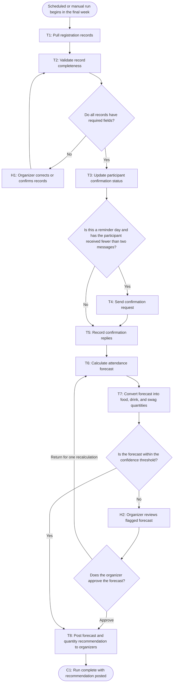

# Workflow of Tasks

## 1. Workflow Overview
### 1.1 Workflow Goal
This workflow supports the system goal defined in `my_first_agent/README.md`.

### 1.2 Workflow Trigger

One run of the workflow begins automatically at 9:00 a.m. on each scheduled forecast day in the final week before the hackathon: seven days before the event, three days before the event, and the morning of the event. An organizer may also start a run manually at any point during that final week when registration numbers change sharply or when a planning decision cannot wait for the next scheduled run.

### 1.3 Completion Condition at Runtime

A run is complete when HackTrack has read every registration record in the current export, produced an attendance forecast with a low, expected, and high headcount, converted that forecast into recommended food, drink, and swag quantities, and posted the recommendation to the organizers' planning channel. If the forecast falls outside the confidence threshold or a record is missing required fields, the run is complete only after an organizer has reviewed the flagged output and either approved it or sent it back for one recalculation. The run ends at the posted recommendation; it does not stay open until the event happens.

### 1.4 General Workflow

On the normal path, HackTrack pulls the current registration records from the club's registration form and validates that each record contains the fields the forecast needs. It then updates each participant's confirmation status as registered, confirmed attending, confirmed not attending, or no response. On the two scheduled reminder days, HackTrack sends a short confirmation request to each participant who has not yet answered and who has received fewer than two messages, then records the replies that come back. With statuses updated, HackTrack calculates an attendance forecast that weights confirmed-attending registrants near certainty and applies the club's historical 40% show rate to registrants who have not responded, and converts that headcount into recommended food, drink, and swag quantities. It posts the forecast and the quantities to the organizers' planning channel, and the run ends there.

Two exceptions interrupt that path. If validation finds records with missing or malformed required fields, HackTrack stops and asks an organizer to correct or confirm those records, then revalidates before continuing; this loop repeats until the records pass. If the calculated forecast falls outside the confidence threshold, for example because the response rate is too low to support a range or because the forecast moved sharply from the previous run, HackTrack flags the forecast for human review instead of posting it. The organizer either approves the flagged forecast, which sends it to the planning channel, or returns it for one recalculation with corrected assumptions. HackTrack never orders food, spends club funds, or contacts a participant more than twice; every purchasing decision stays with a human organizer.

### 1.5 Workflow Diagram

